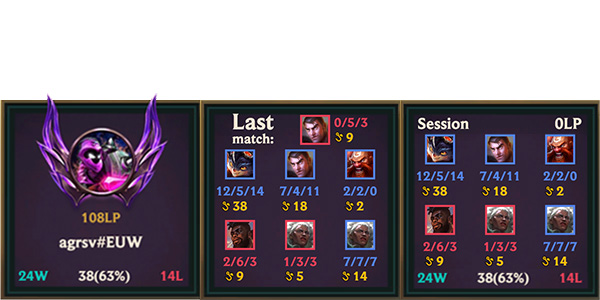

# League of Summoner Widget

The **League of Summoner** widget displays real-time data for a summoner, including:

- **General** - rank, tier, wins, losses, total matches and win percent;
- **Matches** - Match history;
- **Session** - League point, match history, wins, losses, total matches and win percent;

_**No data is stored on our servers.**_
 

### How to Use

Obtain your API key from the [Riot Developer Portal](https://developer.riotgames.com/app-type).

1. **Create an Overlay in StreamElements**

   - Set the dimensions to **200px width** and **300px height**.
   - Add custom widget.
   - Reset position top 0px, left 0px.

2. **Add Code to StreamElements**

   - Open this [link](https://cdn.jsdelivr.net/npm/leagueofsummoner@2.3.5/dist/documentation/streamelements.txt). This file contains code snippets that must be copied into specific tabs in StreamElements Overlay.
   - Ensure all tabs not mentioned in the file remain **empty**.
   - Enter data in each field.

_⚠️ **Important:** Keep your API key secure. Do not share or display it to others. It is stored as a password-type field in the sidebar but can still be accessed in the **DATA tab**. Ensure the **DATA tab** is never shown to anyone._

### How to get Personal API key

To obtain your Personal API Key, refer to the step-by-step instructions provided in [here](https://cdn.jsdelivr.net/npm/leagueofsummoner@2.3.5/dist/documentation/Text%20to%20obtain%20a%20personal%20API%20key.txt). The file contains all the details needed to securely generate your key from the Riot Developer Portal.

### Update version

When a new version of the widget is released, you must **fully reinstall the widget**:

- Delete the previous version of the widget from your StreamElements Overlay.
- Follow the steps in the **How to Use** section to set up the widget again.

### Legal Disclaimer

All summoner icons, champion icons, league icons and League of Legends data are propertary of Riot Games. League of Summoner Widget isn't endorsed by Riot Games and doesn't reflect the views or opinions of Riot Games or anyone officially involved in producing or managing League of Legends, Teamfight Tactics. League of Legends, Teamfight Tactics Riot Games are trademarks or registered trademarks of Riot Games, Inc. League of Legends © Riot Games, Inc.
